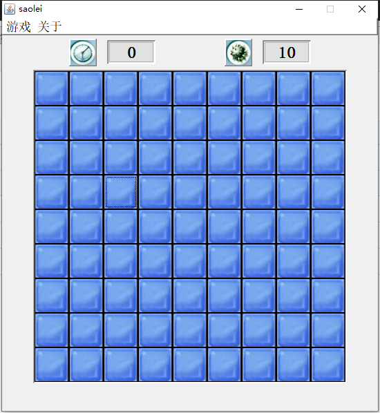
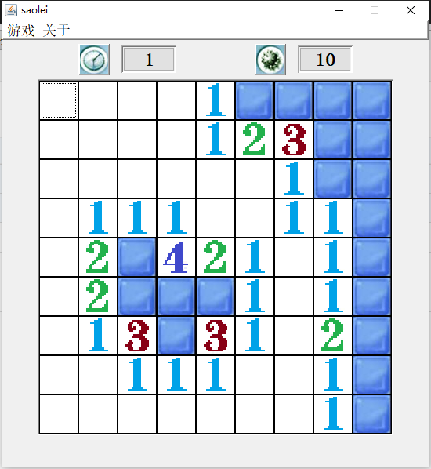
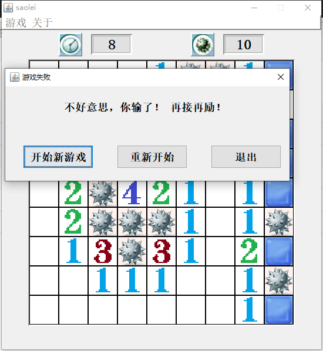
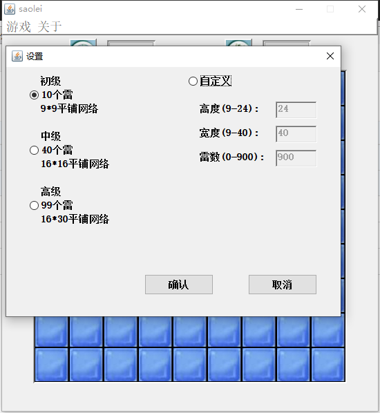

<h1 align="center">基于java的扫雷游戏系统</h1>

 获取sql文件 QQ: 386869957 QQ群: 377586148 

 [个人站点: 从戎源码网](https://armycodes.com/)

## 简介

> 本代码来源于网络,仅供学习参考使用!
>

## 项目介绍

基于java的扫雷游戏系统：采用java的swing开发扫雷界面，玩家操作管理、游戏算法实现、游戏计时与计分、游戏帮助与提示和其他辅助操作；主要功能如下：

- 游戏菜单界面：包括游戏的标题、选择游戏级别的按钮、开始游戏和帮助按钮等元素。
- 游戏级别选择界面：提供不同级别的游戏选择，如简单、中等和困难等级。每个级别对应不同的地雷数量和区域大小。
- 游戏区域界面：显示游戏区域的主窗口，包括地雷标志、数字标志和其他玩家操作的信息。
- 地雷区域选择界面：提供玩家选择地雷区域的交互效果，包括鼠标点击事件的处理、地雷区域的展示和标记等。
- 游戏计时和计分界面：显示玩家的游戏

## 环境

- <b>IntelliJ IDEA 2009.3</b>

- <b>Mysql 5.7.26</b>

- <b>Tomcat 7.0.73</b>

- <b>JDK 1.8</b>

## 运行截图

